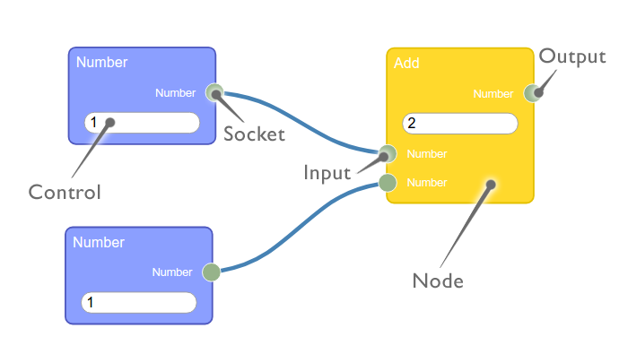

# vue2
## Project setup
```
vue create vue-rete-flow-app
```

## version up (2.6.14 → 2.7.14)
```
npm install vue@2.7.14
```

# rete.js
```
웹에서 비주얼 프로그래밍과 데이터 흐름 기반 워크 플로우를 쉽게 구현할 수 있게 해주는 프레임워크이다.  
노드를 블록처럼 화면에 배치하고, 노드 간 연결(Input/Output)을 통해 데이터가 흐르도록 설계할 수 있다.
```
## 설치 가이드(호환성)
vue 전용 플러그인을 함께 설치한다.
- **vue2 :** rete.js v1 호환
  ```bash
  npm install rete@^1.4.4 rete-connection-plugin@^0.9.0 rete-vue-render-plugin@^0.5.0
  ```
  - rate@1.x 래퍼런스: https://rete.js.org/#/docs
- **vue3 :** rete.js v2 호환
  ```bash
  npm install rete rete-area-plugin rete-connection-plugin rete-render-utils rete-vue-plugin  
  ```
  - rate@2.x 래퍼런스: https://retejs.org/docs
<hr>
<br>

## vue2 - rete 1.x 이슈

### regeneratorRuntime is not defined
```
Babel 트랜스파일러에 의해 구버전 코드로 변경되면서 rete에 구현된 코드중 async/await가 Promise 방식으로 변경되는데, 이때 regeneratorRuntime 라는 이름의 Generator 함수가 필요함.  
reGenerationRuntime은 Babel이 async/await를 변환할 때 필요한 실행 도우미 역할을 하며, 해당 메소드는 core-js polyfill(실행환경 지원)을 통해 불러올 수 있다.  

vue2 프로젝트 생성시 babel을 옵션으로 선택하여 의존성이 설치되었고, core-js도 함께 설치되었음에도 불구하고 설정이 되지 않았던 이유는 사용자 선택 여지로 남겨둔것으로 보인다.
아래와 같이 babel.config.js 파일에 해당 옵션을 설정해줌으로써 reGenerationRuntime에 대한 polyfill import가 코드에 삽입되어 해결된다.
```
- babel.config.js
  ```js
  module.exports = {
    presets: [
      ['@vue/cli-plugin-babel/preset',
        {
          useBuiltIns: 'entry',
          corejs: 3
        }]
    ]
  }
  ```

## 구성요소

- **Nodes**
  - title
  - input
  - output
  - controls
- **Sockets**
- **Editor**
- **Engine**

## 구성요소별 역할 및 특징
### [Nodes](https://rete.js.org/#/docs/nodes)
- 데이터와 포트의 집합으로 데이터 플로우 그래프에서 정점을 표현한다.  
- rete 에서 Node는 블록 형태로 출력되며, 모든 Node에는 title, input, output 및 control을 포함한다.  
  #### `Nodes 구성 요소`
  - **title**
    - Node를 식별하고 그 목적을 명확하게 나타내야 한다.  
  - **Socket (input/output)**
    - input, output은 socket으로 표현되며 이름을 가질 수 있다.  
    - input은 왼쪽, output은 오른쪽에 위치해야한다.  
    - input이 1이라면 output은 N. input과 output간의 관계는 1:N 관계만 지원한다.  
  - **controls**
    - Node 자체 상태값을 설정하기 위한 값을 입력을 받을 수 있는 입력란
    - Node 자체에 직접 위치하거나 특정 Input에 연결될 수 있다.  
      - Node에 위치할 경우 상태값을 설정
      - Input 소켓에 위치할 경우 `연결값이 없을 때만 동작`하는 임시값으로 사용된다.
### [Sockets](https://rete.js.org/#/docs/sockets)
- 노드의 입/출력 타입(type)을 정의하는 역할
- 어떤 값이 어떤 노드로 연결될 수 있는지 결정
- `Nodes 구성요소`로 앞서 설명한바 있음.
### [Controls](https://rete.js.org/#/docs/controls)
- 노드의 기능을 확장하는데 필요하다.
- HTML 템플릿 등을 삽입할 수 있다.
- `Nodes 구성요소`로 앞서 설명한바 있음.
### [Components](https://rete.js.org/#/docs/components)
- Node를 생성하고 동작을 정의하는 설계도 역할을 한다.
- Editor와 Engine에 등록해야 Node를 생성하고 처리할 수 있다.
  #### `Components 구성요소`
  - **builder**
    - Node의 입력(Input), 출력(Output) Control 등을 정의하는 메소드
    - Node가 Editor에 추가될 때 호출되며, Node의 구조를 구성한다.
  - **worker**
    - 실제 데이터 처리 로직을 수행하는 메소드
    - Engine이 Node를 처리할 때 호출되며, 입력값(Inputs)를 받아 출력값(Outputs)으로 변환한다.
### [Editor](https://rete.js.org/#/docs/editor)
- 시각적으로 노드를 화면에 배치하고 연결을 관리하는 역할
- 내부 데이터 처리 로직은 포함하지 않는다
- 생성된 노드 객체를 등록하고, 식별 데이터를 통해 꺼내 사용한다.
### [Engine](https://rete.js.org/#/docs/engine)
- 실제 데이터 처리를 담당.  
- 노드의 스트림을 기반으로 데이터를 처리하고 출력 데이터에서 입력 데이터로 전송이 가능.  
- 화면상에 보이는 Node들은 단순히 editor에 의해 출력되는 반면 실제 값이 어떻게 흐르고 결과가 나오는지는 엔진이 담당함.  
### [Plugin](https://rete.js.org/#/docs/plugins/connection)
- Editor의 기능을 확장하기 위한 모듈
- 드래그 앤 드롭, 연결선 표현, 미니맵, 키보드 단축키 등
- npm패키지로 제공되며 추가로 필요한 플러그인은 따로 설치해줘야 한다.

### [Events](https://rete.js.org/#/docs/events)
- Editor 내부에서 발생하는 동작을 감지하고 처리할 수 있는 기능

